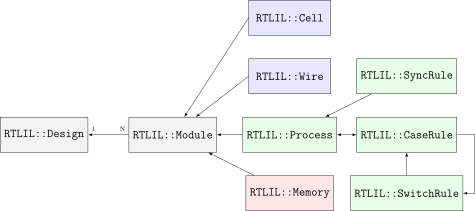

# Yosys manual 日本語版 <!-- omit in toc -->

[Yosys manual](https://yosyshq.readthedocs.io/projects/yosys/en/latest/)

# 概要 <!-- omit in toc -->

今日のデジタル設計のほとんどは、HDL コード (主に Verilog または VHDL) で、HDL 合成ツールの助けを借りて行われています。

粗粒セル ライブラリの合成や新しい合成アルゴリズムのテストなどの特殊なケースでは、カスタム HDL 合成ツールを作成したり、既存のツールに新しい機能を追加したりする必要がある場合があります。このような場合、カスタム ツールのベースとして使用できる フリー アンド オープン ソース (FOSS) 合成ツールが利用できると便利です。

このようなツールがなかったため、Yosys Open SYnthesis Suite (Yosys) が開発されました。このドキュメントでは、このツールの設計と実装について説明します。現時点では、Yosys の主な焦点はデジタル合成の高レベルの側面にあります。Yosys は、既存の FOSS 論理合成ツール ABC を使用して、高度なゲートレベルの最適化を実行します。

実際の設計に基づいた Yosys の評価が含まれています。Yosys をそのまま使用してそのような設計を合成できることが示されています。このテストで Yosys によって生成された結果は、形式的検証を使用して正常に検証されており、商用合成ツールによって生成された結果と品質が同等です。

この文書はもともとウィーン工科大学の学士論文として出版されたものです[Wol13]。

- [1. はじめに](#1-はじめに)
  - [1.1. Yosysの歴史](#11-yosysの歴史)
  - [1.2. 文書の構成](#12-文書の構成)
- [2. 基本原理](#2-基本原理)
  - [2.1. 抽象化のレベル](#21-抽象化のレベル)
    - [2.1.1. システムレベル](#211-システムレベル)
    - [2.1.2. 高レベル](#212-高レベル)
    - [2.1.3. 動作レベル](#213-動作レベル)
    - [2.1.4. レジスタ転送レベル (RTL)](#214-レジスタ転送レベル-rtl)
    - [2.1.5. 論理ゲートレベル](#215-論理ゲートレベル)
    - [2.1.6. 物理ゲートレベル](#216-物理ゲートレベル)
    - [2.1.7. Yosys](#217-yosys)
  - [2.2. 合成可能なVerilogの特徴](#22-合成可能なverilogの特徴)
    - [2.2.1. Structural Verilog](#221-structural-verilog)
    - [2.2.2. Verilog の式](#222-verilog-の式)
    - [2.2.3. 動作モデリング](#223-動作モデリング)
    - [2.2.4. 関数とタスク](#224-関数とタスク)
    - [2.2.5. 条件文、ループ、generate文](#225-条件文ループgenerate文)
    - [2.2.6. 配列とメモリ](#226-配列とメモリ)
  - [2.3. デジタル回路合成における課題](#23-デジタル回路合成における課題)
    - [2.3.1. 規格への準拠](#231-規格への準拠)
    - [2.3.2. 最適化](#232-最適化)
    - [2.3.3. テクノロジーマッピング](#233-テクノロジーマッピング)
  - [2.4. スクリプトベースの合成フロー](#24-スクリプトベースの合成フロー)
  - [2.5. コンパイラ設計の方法](#25-コンパイラ設計の方法)
- [3. アプローチ](#3-アプローチ)
  - [3.1. データおよび制御フロー](#31-データおよび制御フロー)
  - [3.2. Yosys の内部フォーマット](#32-yosys-の内部フォーマット)
  - [3.3. 典型的な使用例](#33-典型的な使用例)
- [4. 実装の概要](#4-実装の概要)
  - [4.1. 簡素化されたデータフロー](#41-簡素化されたデータフロー)
  - [4.2. RTL 中間言語 (RTLIL)](#42-rtl-中間言語-rtlil)
    - [4.2.1. RTLIL 識別子](#421-rtlil-識別子)
    - [4.2.2. RTLIL::Design と RTLIL::Module](#422-rtlildesign-と-rtlilmodule)
    - [4.2.3. RTLIL::Cell と RTLIL::Wire](#423-rtlilcell-と-rtlilwire)
    - [4.2.4. RTLIL::SigSpec](#424-rtlilsigspec)
    - [4.2.5. RTLIL::プロセス](#425-rtlilプロセス)
    - [4.2.6. RTLIL::Memory](#426-rtlilmemory)
  - [4.3. コマンドインターフェイスと合成スクリプト](#43-コマンドインターフェイスと合成スクリプト)
  - [4.4. ソースツリーとビルドシステム](#44-ソースツリーとビルドシステム)
- [5. 内部セルライブラリ](#5-内部セルライブラリ)
  - [5.1. RTLセル](#51-rtlセル)
    - [5.1.1. 単項演算子](#511-単項演算子)
    - [5.1.2. 二項演算子](#512-二項演算子)
    - [5.1.3. マルチプレクサ](#513-マルチプレクサ)
    - [5.1.4. レジスタ](#514-レジスタ)
    - [5.1.5. メモリ](#515-メモリ)
    - [5.1.6. 有限状態マシン](#516-有限状態マシン)
    - [5.1.7. ルールの指定](#517-ルールの指定)
    - [5.1.8. 形式検証セル](#518-形式検証セル)
  - [5.2. ゲート](#52-ゲート)
- [6. Yosys 拡張機能のプログラミング](#6-yosys-拡張機能のプログラミング)
  - [6.1. ガイドライン](#61-ガイドライン)
  - [6.2. 「stubsnets」サンプルモジュール](#62-stubsnetsサンプルモジュール)
- [7. Verilog および AST フロントエンド](#7-verilog-および-ast-フロントエンド)
  - [7.1. Verilog から AST への変換](#71-verilog-から-ast-への変換)
  - [7.2. AST から RTLIL への変換](#72-ast-から-rtlil-への変換)
  - [7.3. always の合成](#73-always-の合成)
  - [7.4. array の合成](#74-array-の合成)
  - [7.5. parameter の合成](#75-parameter-の合成)
- [8. 最適化](#8-最適化)
  - [8.1. 単純な最適化](#81-単純な最適化)
  - [8.2. FSM の抽出とエンコード](#82-fsm-の抽出とエンコード)
  - [8.3. ロジックの最適化](#83-ロジックの最適化)
- [9. テクノロジーマッピング](#9-テクノロジーマッピング)
  - [9.1. セルの置換](#91-セルの置換)
  - [9.2. 部分回路の置換](#92-部分回路の置換)
  - [9.3. ゲートレベルのテクノロジーマッピング](#93-ゲートレベルのテクノロジーマッピング)

# 1. はじめに

## 1.1. Yosysの歴史

## 1.2. 文書の構成

# 2. 基本原理

この章では、デジタル回路合成の基本原理について簡単に説明します。

## 2.1. 抽象化のレベル

デジタル回路は、さまざまな抽象度で表現できます。設計プロセスの上流において、回路は高い抽象度で表現されます。実装とは、より低い抽象度で機能的に同等の表現をすることであるといえます。これがソフトウェアを使用して自動的に行われる場合、合成と言います。

したがって、合成とは、回路の高レベル表現を、機能的に等価な回路の低レベル表現に自動的に変換することです。図 2.1 は、さまざまなレベルの抽象化と、それらがさまざまな種類の合成にどのように関係するかを示しています。


図 2.1さまざまなレベルの抽象化と合成。

回路の下位レベル表現を取得する方法 (合成または手動設計) に関係なく、下位レベル表現は通常、下位レベル表現と上位レベル表現のシミュレーション結果を比較することによって検証されます[1]。したがって、合成が使用されない場合でも、設計の検証を可能にするために、すべてのレベルで回路のシミュレーション可能な表現が存在する必要があります。

注: 「高レベル」などの用語の正確な意味は、もちろん時間が経っても固定されません。たとえば、HDL「ABEL」は 1985 年に「プログラマブル ロジック デバイス用の高水準設計言語」[LHBB85]として初めて導入されましたが、今日では「高水準言語」とみなされません。

### 2.1.1. システムレベル

システムレベルの抽象化では、CPU やコンピューティングコアなどの最大の構成要素のみが考慮されます。このレベルでは、回路は通常、C/C++ や Matlab などの従来のプログラミング言語を使用して記述されます。時として、SystemC など、システムレベルのシミュレーションを目的とした特別なソフトウェアライブラリが使用される場合があります。

通常、回路のシステムレベル表現を低レベル表現に自動的に変換する合成ツールは使用されません。ただし、システムレベルのブロックを接続するために使用できるシステムレベルの設計ツールが存在します。

IEEE 1685-2009 は、システム レベルの設計を表すために使用できる IP-XACT ファイル形式と、そのようなシステム レベルの設計で使用できるビルディングブロックを定義します。[ A+10 ]

### 2.1.2. 高レベル

システムの高レベルの抽象化 (アルゴリズムレベルと呼ばれることもあります) も、従来のプログラミング言語を使用して表現されることがよくありますが、機能が制限されています。たとえば、C 言語で高レベルの抽象化で設計を表現する場合、ポインタはメモリ インターフェイスなどのハードウェアに見られる概念を模倣するためにのみ使用できます。完全な動的メモリ管理機能は、デジタル回路に対応する概念がないため許可されません。

高レベル コード (通常は追加のメタデータを含む C/C++/SystemC コードの形式) を動作 HDL コード (通常は Verilog または VHDL コードの形式) に合成するツールが存在します。高位合成用の多くの商用ツールの他に、高位合成用の FOSS ツールも多数あります。

### 2.1.3. 動作レベル

動作レベルでは、回路の記述にはVerilogやVHDLなどのハードウェア記述を目的とした言語が使用されますが、回路記述の少なくとも一部にはいわゆる動作モデリングが使用される。動作モデリングでは、命令型プログラミングを使用してデータ パスとレジスタを記述することを可能にする言語機能が必要です。これは、Verilog の always ブロックと VHDL の process ブロックです。

動作モデリングでは、コードフラグメントが機密性リストとともに提供されます。信号と条件のリスト。シミュレーションでは、感度リスト内の信号の値が変更されるか、感度リスト内の条件がトリガーされるたびに、コード フラグメントが実行されます。合成ツールは、この表現を適切なデータパスに転送し、その後に適切なタイプのレジスタを転送できなければなりません。

たとえば、次の Verilog コードを考えてみましょう。

```
always @(posedge clk)
    y <= a + b;
```

シミュレーションでは、`clk` 信号のポジティブエッジが検出されるたびに `y <= a + b` が実行されます。ただし、合成結果には常に `a+b` を計算する加算器が含まれ、その後に加算器出力を D 入力に、信号を Q 出力に持つ D型フリップフロップ `y` が接続されます。

通常、動作モデリングで使用される命令型コードには、ループを完全に展開できる限り、条件文 (Verilog の `if` および `case`) とループを含めることができます。

興味深いことに、Verilog または VHDL の動作合成を実行できる FOSS ツールは Yosys 以外にないようです。

### 2.1.4. レジスタ転送レベル (RTL) 

レジスタ転送レベルでは、回路は組み合わせデータパスとレジスタ (通常は D型フリップフロップ) によって表されます。次の Verilog コードは、前の Verilog の例と同等ですが、RTL 表現になっています。

```
assign tmp = a + b;       // combinatorial data path

always @(posedge clk)     // register
    y <= tmp;
```

RTL 表現のデザインは通常、Verilog や VHDL などの HDL を使用して保存されます。ただし、使用される機能は非常に限られており、使用されるレジスタタイプとデータパス ロジックの無条件割り当てをモデル化する最小限の Always ブロック (Verilog) またはプロセスブロック (VHDL) のみです。このレベルで HDL を使用すると、RTL 表現でデザインをシミュレーションするために追加のツールが必要ないため、シミュレーションが簡素化されます。

多くの最適化と分析は、RTL レベルで最適に実行できます。例には、FSM の検出と最適化、メモリまたはその他のより大きな構成要素の識別、共有可能なリソースの識別などが含まれます。

RTL は、回路が回路要素 (レジスタおよび組合回路) と信号のグラフとして表現される最初の抽象化レベルであることに注意してください。このようなグラフをセルと接続のリストとしてエンコードすると、ネットリストと呼ばれます。

ネットリスト内の各回路ノード要素を等価なゲートレベルの回路に置き換えるだけで済むため、RTL 合成は簡単です。ただし、通常、RTL 合成という用語は、RTL ネットリストをゲートレベルのネットリストに合成することだけを指すのではなく、上に挙げた例のように、RTL 表現内で多くの高度な最適化を実行することも指します。

RTL 合成ステップのドメイン内で個別のタスクを実行できる FOSS ツールが多数存在します。しかし、広範囲の RTL 合成操作をカバーする FOSS ツールはないようです

###  2.1.5. 論理ゲートレベル

論理ゲート レベルでは、デザインは、基本的な論理ゲート (AND、OR、NOT、XOR など) やレジスタ (通常は D タイプ) などの少数のシングル ビット セルのセルのみを使用するネットリストによって表されます。ビーチサンダル）。

電子設計交換フォーマット (EDIF) など、このレベルで使用できるネットリスト フォーマットが多数存在しますが、シミュレーションを容易にするために、HDL ネットリストが使用されることがよくあります。後者は、セルのインスタンス化と接続に最も基本的な言語構造のみを使用する HDL ファイル (Verilog または VHDL) です。

論理合成には 2 つの課題があります。1 つはゲート レベルのネットリスト内で最適化の機会を見つけること、2 つ目は論理ゲート ネットリストを物理的に利用可能なゲート タイプの同等のネットリストに最適 (または少なくとも良好な) マッピングすることです。

論理合成への最も単純なアプローチは 2 レベル論理合成です。この場合、論理関数は、たとえばカルノー図を使用して積和表現に変換されます。これは単純なアプローチですが、最悪の場合の労力が指数関数的に増加し、AND/NAND、OR/NOR、および NOT ゲート以外の物理ゲートを効率的に使用できません。

したがって、最新の論理合成ツールは、より複雑なマルチレベル論理合成アルゴリズム[ BHSV90 ]を利用しています。これらのアルゴリズムのほとんどは、論理関数を Binary-Decision-Diagram (BDD) または And-Inverter-Graph (AIG) に変換し、その表現に基づいて動作します。前者には、独自の正規化された形式があるという利点があります。後者の方が最悪の場合のパフォーマンスがはるかに優れているため、大規模な論理関数の合成に適しています。

マルチレベル論理合成用の優れた FOSS ツールが存在します。

Yosys には基本的な論理合成機能が含まれていますが、論理合成ステップに ABC を使用することもできます。ABCの使用をお勧めします。

### 2.1.6. 物理ゲートレベル

物理ゲートレベルでは、ターゲットアーキテクチャで物理的に利用可能なゲートのみが使用されます。
場合によっては、これは D型レジスタだけでなく、NAND、NOR、NOT ゲートのみである場合もあります。
他の場合には、論理ゲートレベルで使用されるセルよりも複雑なセル (完全な半加算器など) が含まれる場合があります。
FPGA ベースのデザインの場合、物理ゲートレベルの表現は、オプショナルな出力レジスタを備えた LUT のネットリストです。
これは、これらがFPGAロジックセルの基本構成要素であるためです。

合成ツールチェーンの場合、この抽象化は通常、最低レベルになります。
ASICベースの設計の場合、セルライブラリには、物理​​セルが個々のスイッチ (トランジスタ) にどのようにマッピングされるかに関する詳細情報が含まれる場合があります。

### 2.1.7. Yosys

Yosys は Verilog HDL 合成ツールです。
これは、動作デザイン記述を入力として受け取り、デザインの RTL、論理ゲート、または物理ゲート レベルの記述を出力として生成することを意味します。
Yosys の主な強みは動作と RTL 合成です。
Yosys 内には広範囲のコマンド (合成パス) が存在し、動作合成、rtl 合成、および論理合成の領域内で幅広い合成タスクを実行するために使用できます。
Yosys は拡張可能に設計されているため、特殊なタスク用のカスタム合成ツールを実装するための優れた基盤となります。

## 2.2. 合成可能なVerilogの特徴

合成可能な Verilog [ A+06 ]のサブセットは、別の IEEE 標準文書である IEEE 標準 1364.1-2002 [ A+02 ]で指定されています。
この標準は、特定の言語構造が合成の範囲内でどのように解釈されるかについても説明します。

このセクションでは、合成可能な Verilog の最も重要な機能の概要を、複雑さの順に構造化して説明します。

### 2.2.1. Structural Verilog

Structural Verilog (Verilog ネットリストとも呼ばれる) は、Verilog 構文のネットリストです。
この場合、次の言語構造のみが使用されます。

- 定数値
- ワイヤーとポートの宣言
- 信号の他の信号への静的な割り当て
- セルのインスタンス化

多くのツール (特に合成チェーンのバックエンド) は、入力としてStructual Verilog のみをサポートします。
ABC はそのようなツールの一例です。
残念ながら、Structural Verilog が実際に何であるかを指定する標準は存在しないため、
属性やマルチビット信号などの機能に関して、どのような構文構造が構造 Verilog でサポートされるかについて混乱が生じています。

### 2.2.2. Verilog の式

Verilog が定数値、信号名、 演算子（`+` `-` `*` などの算術演算、`&` `|` `^` などのブール演算、比較演算、単項演算子など）を用いた式を受け付ける場合、それらを使用でき*ます。

合成中に、これらの演算子は、それぞれの関数を実装するセルに置き換えられます。

Verilog を処理できると主張する多くの FOSS ツールは、実際には基本的な Structual Verilog と単純な式のみをサポートしています。Yosys を使用すると、フル機能の合成可能な Verilog をこの単純なサブセットに変換できるため、そのようなアプリケーションをより豊富な Verilog 機能セットで使用できるようになります。

### 2.2.3. 動作モデリング

Verilog always ステートメントを利用するコードは、動作モデリングを使用しています。
動作モデリングでは、回路は特定のイベント、つまり信号の変化、立ち上がりエッジ、または立ち下がりエッジで実行される命令型プログラム コードによって記述されます。
これはシミュレーション中は非常に柔軟な構造ですが、次のいずれかがモデル化されている場合にのみ合成可能です。

- 非同期またはラッチされたロジック
- 
この場合、sensitivity リストには、always ブロック内で使用されるすべての式が含まれている必要があります。
`@*`はこのような場合に使用できます。
この種の例には次のようなものがあります。

```
// asynchronous
always @* begin
    if (add_mode)
        y <= a + b;
    else
        y <= a - b;
end

// latched
always @* begin
    if (!hold)
        y <= a + b;
end
```

ラッチされたロジックは、多くの場合、悪いスタイルであると考えられており、多くの場合、単にずさんな HDL 設計の結果であることに注意してください。
したがって、多くの合成ツールは、ラッチされたロジックが生成されるたびに警告を生成します。

- 同期ロジック (オプションの同期リセット付き)

これは、出力に DFF を備えたロジックです。この場合、sensitivity　リストにはそれぞれのクロックエッジのみが含まれている必要があります。

```
// counter with synchronous reset
always @(posedge clk) begin
    if (reset)
        y <= 0;
    else
        y <= y + 1;
end
```

- 非同期リセットを備えた同期ロジック

これは、出力に非同期リセットを備えた D タイプ フリップフロップを備えたロジックです。
この場合、sensitivity リストにはそれぞれのクロックエッジとリセットエッジのみが含まれている必要があります。
リセット分岐に割り当てられる値は定数である必要があります。

```
// counter with asynchronous reset
always @(posedge clk, posedge reset) begin
    if (reset)
        y <= 0;
    else
        y <= y + 1;
end
```

Yosys を含む多くの合成ツールは、always ステートメントを使用してモデル化できるフリップフロップの幅広いサブセットをサポートしています。
ただし、Verilog 合成の標準でカバーされるのは上記に挙げたものだけであり、新しいデザインを作成する場合はこれらのケースに限定する必要があります。

動作モデリングでは、ブロッキング代入 `=` と非ブロッキング代入 `<=` を使用できます。
ブロッキング代入と非ブロッキング代入の概念は、Verilog [CI00]で最も誤解されている構造の 1 つです。

ブロッキング代入は、命令型プログラミング言語の代入とまったく同じように動作しますが、
非ブロッキング代入では、代入の右側はすぐに評価されますが、左側のレジスタの実際の更新はタイムステップの終わりまで遅延されます。
たとえば、次のVerilog コードは2 つのレジスタの値を交換します。

```
a <= b;
b <= a;
```

### 2.2.4. 関数とタスク

Verilog は、複数の場所で使用されるステートメントをバンドルする関数とタスクをサポートしています (命令型プログラミングのプロシージャと同様)。
どちらの構成も、関数/タスク呼び出しを関数またはタスクの本体に置き換えることで簡単に実装できます。

### 2.2.5. 条件文、ループ、generate文

Verilog は、`if-else`-statements と `always` 文内の `for` ループをサポートします。

また、`generate`文中で両方の機能もサポートされます。
if-elseこれを使用して、モジュール パラメータに基づいてモジュールの一部を選択的に有効または無効にしたり ( )、または同様のサブ回路のセットを生成したり ( for)することができます。

if-elsealways ブロック内の -statement は動作モデリングの一部ですが、
他の 3 つのケースは (少なくとも合成ツールの場合) 組み込みマクロ プロセッサの一部です。
したがって、合成ツールはすべてのループを完全に展開し、const-folding を使用して -statementsif-else内のすべての -statementの条件を評価できる必要があります。generate

### 2.2.6. 配列とメモリ

Verilog は配列をサポートしています。
これは一般に、合成可能な言語の機能です。
ほとんどの場合、配列はアドレス指定可能なメモリを生成することで合成できます。
ただし、複雑なアクセス パターンや非同期アクセス パターンが使用される場合、配列をメモリとしてモデル化することはできません。
このような場合、配列はワードごとに個別の信号を使用してモデル化する必要があり、配列へのすべてのアクセスは大規模なマルチプレクサを使用して実装する必要があります。

場合によっては、メモリを使用して配列をモデル化することも可能ですが、それは望ましくありません。次の遅延回路を考えてみましょう。

```
module (clk, in_data, out_data);

parameter BITS = 8;
parameter STAGES = 4;

input clk;
input [BITS-1:0] in_data;
output [BITS-1:0] out_data;
reg [BITS-1:0] ffs [STAGES-1:0];

integer i;
always @(posedge clk) begin
    ffs[0] <= in_data;
    for (i = 1; i < STAGES; i = i+1)
        ffs[i] <= ffs[i-1];
end

assign out_data = ffs[STAGES-1];

endmodule
```

これは、STAGES 入力ポートと出力ポートを備えたアドレス指定可能なメモリを使用して実装できます。
より良い実装は、フリップフロップの単純なチェーン (いわゆるシフト レジスタ) を使用することです。
このより優れた実装は、最初にメモリベースの実装を作成し、次にすべてのポートの静的アドレス信号に基づいて最適化するか、
言語フロントエンドでそのような状況を直接識別し、すべてのメモリアクセスを正しい信号への直接アクセスに変換することによって実現できます。 

## 2.3. デジタル回路合成における課題

このセクションでは、デジタル回路合成における最も重要な課題を要約します。
ツールは、これらのトピックにどれだけうまく対処できるかによって特徴づけられます。

### 2.3.1. 規格への準拠

最も重要な課題は、当該の HDL 標準規格 (Verilog の場合、IEEE 標準 1364.1-2002 および 1364-2005) への準拠です。
これは次の 2 つの項目に分類できます。

- 標準の実装の完全性
- 標準の実装の正確さ

完全性は、既存の HDL コードとの互換性を保証するために最も重要です。
デザインが検証され、テストされると、HDL 設計者は、たとえ新しい合成ツールで欠落している機能を回避するためのわずかな変更が数件程度であっても、デザインの変更には非常に消極的になります。

正確さは非常に重要です。
一部の領域では、これは明らかです (基本的な動作モデルの正しい合成など)。
しかし、これは、HDL コードが別の合成ツールを対象としていない場合でも、符号付き式を処理するための正確なルールなど、規格の細かい詳細に関係する領域にとっても重要です。
これは、(コンパイラによってのみ処理されるソフトウェア ソース コードとは異なり) ほとんどのデザイン フローでは、
HDL コードが合成ツールによって処理されるだけでなく、1 つ以上のシミュレータによって処理され、
場合によっては正式な検証ツールによっても処理されるためです。
この検証プロセスでは、これらすべてのツールが HDL コードに対して同じ解釈を使用することが重要です。

### 2.3.2. 最適化

一般に、合成ツールがデザインをどの程度最適化するかを一次元で説明することは困難です。
まず第一に、すべての最適化がすべてのデザインやすべての合成タスクに適用できるわけではないからです。
最適化の中には、粗粒度レベル (加算器や乗算器などの複雑なセルを使用) で (最適に) 機能するものと、
粒度の細かいレベル (シングル ビット ゲート) で (最適に) 機能するものがあります。
サイズをターゲットとする最適化もあれば、速度をターゲットにする最適化もあります。
大規模なデザインでうまく機能するものもありますが、拡張性が低く、小さなデザインにしか適用できないものもあります。

優れたツールは、さまざまな抽象化レベルで幅広い最適化を適用でき、
どの最適化を実行する (またはスキップする) か、最適化の目標を設計者が制御できます。

### 2.3.3. テクノロジーマッピング

テクノロジー マッピングは、デザインをターゲット アーキテクチャで使用可能なセルのネットリストに変換するプロセスです。
ASIC フローでは、これは工場によって提供されるプロセス固有のセル ライブラリである可能性があります。
FPGA フローでは、これは LUT セルや専用乗算器などの特殊な機能ユニットである場合があります。
Coarse-grain のフローでは、これはさらに複雑な特殊機能ユニットになる可能性があります。

オープンでベンダーに依存しないツールは、さまざまなタイプのターゲットアーキテクチャを広範囲にサポートする場合に特に興味深いものになります。

## 2.4. スクリプトベースの合成フロー

デジタル設計は通常、目的の機能の高レベルまたはシステムレベルのシミュレーションを実装することによって開始されます。
次に、この記述は、合成可能な下位レベルの記述 (通常は動作レベル) に手動で変換 (または再実装) され、
両方をシミュレーションしてシミュレーション結果を比較することによって、2 つの表現の等価性が検証されます。

次に、一連のツールを使用して合成可能な記述が低レベルの表現に変換され、その結果がシミュレーションを使用して再度検証されます。このプロセスを図 2.2に示します。


図 2.2 一般的な設計フロー。緑色のボックスは手動で作成されたモデルを表します。オレンジ色のボックスは、合成ツールによって生成されたモデルを表します。

この例では、システム レベル モデルと動作モデルは両方とも手動で作成された設計ファイルです。
システム レベル モデルと動作モデルの同等性が検証された後、合成ツールを使用してデザインの下位レベルの表現を生成できます。
最後に、RTL モデルとゲートレベル モデルが検証され、設計プロセスは終了します。

ただし、実際の設計作業では、この設計プロセスを複数回繰り返すことになります。
この理由としては、設計要件の変更が遅かったこと、または低抽象化モデルの解析 (ゲート レベルのタイミング解析など) により、
設計要件 (最大値など) を満たすために設計変更が必要であることが判明したことが考えられます。可能なクロック速度）。

動作モデルまたはシステム レベル モデルが変更されるたびに、
シミュレーションを再実行して結果を比較することによって、
それらの等価性を再検証する必要があります。
動作モデルが変更されるたびに、合成を再実行し、合成結果を再検証する必要があります。

再現性を保証するには、固定の設定セットを使用して設計プロジェクトのすべての自動ステップを簡単に再実行できることが重要です。
このため、通常、合成フローで使用されるすべてのプログラムはスクリプトを使用して制御できます。
これは、すべての機能がテキスト コマンド経由で利用できることを意味します。
このようなツールが GUI を提供する場合、これはコマンド ライン インターフェイスを補完するものであり、
コマンド ライン インターフェイスの代わりとなるものではありません。

通常、UNIX/Linux 環境の合成フローは、必要なすべてのツール (この例では合成およびシミュレーション/検証) を正しい順序で呼び出すシェル スクリプトによって制御されます。
これらの各ツールは、それぞれのツールのコマンドを含むスクリプト ファイルを使用して呼び出されます。
ツールに必要なすべての設定はこれらのスクリプト ファイルによって提供されるため、手動による操作は必要ありません。
これらのスクリプト ファイルは設計ソースとみなされ、システム レベルのソース コードや動作モデルと同様にバージョン管理下に保管される必要があります。

## 2.5. コンパイラ設計の方法

合成ツールの一部には、コンパイラ設計から伝統的に知られている問題領域が含まれます。
このセクションでは、これらのドメインのいくつかについて説明します。

【コンパイラの話なので省略】

# 3. アプローチ

Yosys は、ターゲット アーキテクチャ ネットリストに対して Verilog HDL コードを合成 (動作) するためのツールです。
Yosys は幅広いアプリケーション ドメインを対象としているため、新しいタスクに柔軟に簡単に適応できる必要があります。
この章では、このツールを実装するために採用される一般的なアプローチについて説明します。

## 3.1. データおよび制御フロー

一般的な合成ツールのデータおよび制御フローは、一般的なコンパイラのデータおよび制御フローと非常に似ています。
さまざまなサブシステムが所定の順序で呼び出され、
それぞれが最後のサブシステムによって生成されたデータを消費して、
データを生成します。
次のサブシステム用です (図 3.1を参照)。


図 3.1合成ツールの一般的なデータおよび制御フロー

最初に呼び出されるサブシステムはフロントエンドと呼ばれます。
別のサブシステムによって生成されたデータを処理するのではなく、
ユーザー入力 (HDL 合成ツールの場合はビヘイビア HDL コード) を読み取ります。

前のサブシステムからのデータを消費し、
次のサブシステムのデータを (通常は同じまたは類似の形式で) 生成するサブシステムは、パスと呼ばれます。

実行される最後のサブシステムは、最後のパスで生成されたデータを適切な出力形式に変換し、ファイルに書き込みます。
このサブシステムは通常、バックエンドと呼ばれます。

Yosys では、すべてのフロントエンド、パス、バックエンドが合成スクリプトのコマンドとして直接使用できます。
したがって、ユーザーは合成スクリプト内で正しい順序でパスを呼び出すだけでカスタム合成フローを簡単に作成できます。

## 3.2. Yosys の内部フォーマット

Yosys は 2 つの異なる内部形式を使用します。
1 つ目は、Verilog 入力ファイルの抽象構文ツリー (AST) を保存するために使用されます。
この形式は単に AST と呼ばれ、Verilog フロントエンドによって生成されます。
このデータ構造は、AST フロントエンド[1]と呼ばれるサブシステムによって使用されます。
この AST フロントエンドは、Yosys の主要な内部フォーマットである Register-Transfer-Level-Intermediate-Language (RTLIL) 表現でデザインを生成します。
これは、まず AST 表現内でいくつかの単純化を実行し、次に単純化された AST データ構造から RTLIL を生成することによって行われます。

RTLIL 表現は、すべてのパスで入力および出力として使用されます。
これには、異なるパス間で異なる表現形式を使用する場合に比べて、次の利点があります。

- パスは別の順序で並べ替えたり、パスを削除または挿入したりできます。
- パスは、フォーマット間の変換を必要とせずに、変更しないデザインの部分を単純にパススルーできます。
  実際、Yosys は入力として受け取ったのと同じデータ構造を出力に渡し、すべての変更をその場で実行します。
- すべてのパスは同じインターフェイスを使用するため、Yosys ソース コードを読むとき (追加機能を追加するときなど) にパスを理解するために必要な労力が軽減されます。

RTLIL 表現は基本的に次の追加機能を備えたネットリスト表現です。

- RTL データパスとレジスタ セル、および論理ゲート レベル セル (シングル ビット ゲートとレジスタ) を表す固定機能セルを備えた内部セル ライブラリ。
- ワイヤからの個々のビットだけでなく、粗粒ネットリストを表す定数ビットも使用できるマルチビット値のサポート。
- 基本的な動作構造 (出力を更新するための感度リストを備えた if-then-else 構造およびマルチケース スイッチ) のサポート。
- マルチポートメモリのサポート。

RTLIL の使用には、より高度な機能が必要ないゲート レベルの合成を行う場合でも、
すべてのパス間に非常に強力なフォーマットが必要になるという欠点もあります。
低レベル表現で動作するパスの複雑さを軽減するために、
これらのパスは入力 RTLIL で使用されている機能をチェックし、
サポートされていない高レベルの構造が使用されている場合は実行に失敗します。
このような場合、上位レベルの構成を下位レベルの構成に変換するパスを最初に合成スクリプトから呼び出す必要があります。

## 3.3. 典型的な使用例

次のスクリプト例は、Liberty ファイルで記述されたセル ライブラリを使用して、
ビヘイビア Verilog コードを入力ファイル design.v から
ゲート レベルのネットリスト synth.v に変換する合成フローで使用できます。

```
# read input file to internal representation
read_verilog design.v

# convert high-level behavioral parts ("processes") to d-type flip-flops and muxes
proc

# perform some simple optimizations
opt

# convert high-level memory constructs to d-type flip-flops and multiplexers
memory

# perform some simple optimizations
opt

# convert design to (logical) gate-level netlists
techmap

# perform some simple optimizations
opt

# map internal register types to the ones from the cell library
dfflibmap -liberty cells.lib

# use ABC to map remaining logic to cells from the cell library
abc -liberty cells.lib

# cleanup
opt

# write results to output file
write_verilog synth.v
```

Yosys で使用できるコマンドの詳細な説明は、「コマンド ライン リファレンス」を参照してください。

[1] Yosys では、パスという用語は、RTLIL データ構造上で動作するコマンドを指すためにのみ使用されます。

# 4. 実装の概要

Yosys は、拡張可能なオープンソースのハードウェア合成ツールです。
これは、簡単にアクセスでき、ユニバーサルでベンダーに依存しない合成ツールを探している設計者だけでなく、
電子設計自動化 (EDA) の研究を行っており、テストに使用できるオープン合成フレームワークを探している科学者も対象としています。
複雑な現実世界の設計に関するアルゴリズム。

Yosys は Verilog 2005 の大規模なサブセットを合成でき、 
OpenRISC 1200 CPU、openMSP430 CPU、OpenCores I2C マスター、およびk68 CPUを含む
幅広い実際の設計でテストされています。

この記事の執筆時点では、Yosys VHDL フロントエンドが開発中です。

Yosys は C++ で書かれています (新しい C++11 標準の一部の機能を使用します)。
この章では、Yosys の基本的なデータ構造のいくつかについて説明します。
わかりやすくするために、この章では Yosys 実装で使用される C++ 型名を使用します。
ただし、この章ではその背後にある概念的な考え方のみが説明されており、
任意の言語で同様のシステムを実装するための参照として使用できます。

## 4.1. 簡素化されたデータフロー

図 4.1 は、 Yosys 内の簡略化されたデータ フローを示しています。
図中の長方形はプログラム モジュールを表し、
楕円はプログラム モジュール間で設計データを交換するために使用される内部データ構造を表します。

設計データは、フロントエンド モジュールの 1 つを使用して読み込まれます。
Verilog および VHDL コードの高レベル HDL フロントエンドは、抽象構文ツリー (AST) を生成し、それが AST フロントエンドに渡されます。
どちらの HDL フロントエンドも、Verilog HDL および VHDL 言語をカバーするのに十分強力な同じ AST 表現を使用していることに注意してください。

次に、AST フロントエンドは、AST を Yosys の主要な内部データ形式である RTL 中間言語 (RTLIL) にコンパイルします。
この形式の詳細については、次のセクションで説明します。

RTLIL フロントエンドを使用して解析できる RTLIL データ構造のテキスト表現もあります。

次に、設計データは、設計の RTLIL 表現に対してすべて動作する一連のパスを使用して変換できます。

最後に、RTLIL 表現のデザインは、バックエンドの 1 つによってテキストに変換されます。
つまり、Verilog ネットリストを生成する Verilog バックエンドと、
RTLIL フロントエンドが理解できる同じフォーマットで RTLIL データを書き込む RTLIL バックエンドです。

高レベルの HDL フロントエンドによって呼び出され、ユーザーが直接呼び出すことができない AST フロントエンドを除いて、
すべてのプログラム モジュールはユーザーによって呼び出されます (通常は、Yosys のテキスト コマンドを含む合成スクリプトを使用します)。 。

さまざまな方法でパスを組み合わせたり、Yosys にパスを追加したりすることで、
Yosys を幅広いアプリケーションに適応させることができます。
これを可能にするためには、

1. すべてのパスが同じデータ構造 (RTLIL) 上で動作すること
2. このデータ構造が合成のさまざまな段階でデザインを表現するのに十分強力であること

が重要です。


図 4.1 Yosys の簡略化されたデータフロー (楕円: データ構造、長方形: プログラムモジュール) 

## 4.2. RTL 中間言語 (RTLIL)

Yosys のすべてのフロントエンド、パス、バックエンドは、RTLIL 表現で動作します。
唯一の例外は、RTLIL データを生成する前の中間ステップとして AST 表現を使用する高レベルのフロントエンドです。

RTLIL クラスの名前の再発明を避けるために、このドキュメントでは、RTLIL クラスを完全な C++ 名、つまり RTLIL:: 名前空間プレフィックスを含めて表記します。

図 4.2 は、 RTLIL の簡略化されたエンティティ関係図 (ER 図) を示しています。
1:Nの関係は、Nから1へ向かう矢印で表現します。
たとえば、1 つの `RTLIL::Design` にはN個の `RTLIL::Module` のインスタンスが含まれます。

`RTLIL::Design` は、RTLIL データ構造のルート オブジェクトです。
メモリ内には常に 1 つの「現在のデザイン」があり、パスが操作され、フロントエンドがデータを追加し、バックエンドがエクスポート可能な形式に変換します。
ただし、場合によっては、パスが内部で追加の `RTLIL::Design` オブジェクトを生成することがあります。
たとえば、パスがセル ライブラリなどの補助 Verilog ファイルを読み取っている場合、
追加の `RTLIL::Design` オブジェクトを作成し、
この他のオブジェクトを使用して Verilog フロントエンドを呼び出してセル ライブラリを解析することがあります。



図 4.2簡略化された RTLIL エンティティ関係図

アクティブな `RTLIL::Design` オブジェクトは 1 つだけあり、
これは、合成スクリプトなどを使用してユーザーによって呼び出される
すべてのフロントエンド、パス、およびバックエンドによって使用されます。
`RTLIL::Design` には、0以上のN個の `RTLIL::Module` オブジェクトが含まれます。
これは、Verilog のモジュールまたは VHDL のエンティティに対応します。
各モジュールには、次の 3 つの異なるカテゴリのオブジェクトが含まれています。

- `RTLIL::Cell` オブジェクトと `RTLIL::Wire` オブジェクトは古典的なネットリスト データを表します。
- `RTLIL::Process` オブジェクトは、Verilog always および VHDL プロセス ブロックからの決定ツリー (if-then-else ステートメントなど) と同期宣言 (クロック信号と感度) を表します。
- `RTLIL::Memory` オブジェクトは、アドレス指定可能なメモリ (配列) を表します。

通常、合成プロシージャの出力はネットリストです。
つまり、すべての RTLIL::Process オブジェクトと RTLIL::Memory オブジェクトは、
合成パスによって RTLIL::Cell オブジェクトと RTLIL::Wire オブジェクトに置き換えられる必要があります。

これらの RTLIL クラスに直接マッピングできない HDL のすべての機能は、
HDL フロントエンドによって RTLIL 互換の表現に変換する必要があります。
これには、生成ブロック、ループ、パラメーターなどの Verilog 機能が含まれます。

次のセクションでは、RTLIL のさまざまな部分と、いくつかの設計上の決定の背後にある理論的根拠についてより詳細に説明します。

### 4.2.1. RTLIL 識別子

RTLIL のすべての識別子 (モジュール名、ポート名、信号名、セル タイプなど) は次の命名規則に従います。
> バックスラッシュ (\\) またはドル記号 ($) で始まる

バックスラッシュで始まる識別子は、パブリックに表示される識別子です。
通常、これらは HDL 入力ファイルの 1 つから生成されます。
たとえば、信号名「\\sig42」は、HDL 入力ファイル内で名前「sig42」を使用して宣言された信号である可能性が高くなります。
一方、シグナル名「$sig42」は自動生成されたシグナル名です。
バックエンドは、ドル記号で始まるすべての識別子を、バックスラッシュで始まる識別子と衝突しない識別子に変換します。

これには次の 3 つの利点があります。

- 自動生成された識別子がユーザーによって提供された識別子と衝突することはあり得ません。
- ユーザーが最初に提供した識別子に関する情報は常に利用可能であり、最適化のガイドに役立ちます。
  たとえば、「opt_rmunused」はユーザーが指定した名前で信号を保存しようとしますが、
  他の信号を複製するだけの場合は、自動生成された名前を持つ信号を躊躇なく削除します。
- 第三に、適切な自動生成された公開表示名を見つけるというデリケートな作業は、中央の 1 つの場所に延期されます。
  Yosys 開発者にとって重要な情報を保持している可能性がある内部で自動生成された名前は、外部ツールを妨げることなく使用できます。
  たとえば、Verilog バックエンドは、_integer_ の形式で名前を割り当てます。

RTLIL 識別子では、空白文字と制御文字 (ASCII コード 32 以下の任意の文字) は使用できません。
ほとんどのフロントエンドとバックエンドは、識別子でこれらの文字をサポートできません。

プログラミング エラーを回避するために、RTLIL データ構造では、
すべての識別子がバックスラッシュまたはドル記号で始まり、
空白文字や制御文字が含まれていないかをチェックします。
これらのルールに違反すると、実行時エラーが発生します。

すべての RTLIL 識別子では大文字と小文字が区別されます。

フラット化などの一部の変換では、名前の衝突を避けるためにユーザーが指定した識別子を変更する必要がある場合があります。
この場合、変更された識別子を持つオブジェクトに属性「hdlname」が付加されます。
この属性には、1 つの名前 (フロントエンドによって直接発行された場合、または曖昧さ回避の結果である場合) 
またはスペースで区切られた複数の名前 (フラット化の結果である場合) が含まれます。
「hdlname」属性で指定されたすべての名前はパブリックであり、先頭の「"」は含まれません。

### 4.2.2. RTLIL::Design と RTLIL::Module

`RTLIL::Design` オブジェクトは基本的に `RTLIL::Module` オブジェクトの単なるコンテナです。
`RTLIL::Module` オブジェクトのリストに加えて、`RTLIL::Design` は選択されたオブジェクト、つまり渡されるオブジェクトのリストも保持します。
ほとんどの場合、デザイン全体が選択されるため、パスはデザイン全体に作用します。
ただし、このメカニズムは、デザインの一部のみが特定のパスの影響を受ける必要がある、より複雑な合成ジョブに役立ちます。

図 4.2の ER 図に示されているオブジェクトの他に、`RTLIL::Module` オブジェクトには次の追加プロパティが含まれています。

- モジュール名
- 属性のリスト
- ワイヤー間の接続のリスト
- モジュールのパラメータ化されたバリエーションを導出するために使用されるオプションのフロントエンド コールバック

属性には、Verilog フロントエンドによってインポートされた Verilog 属性、またはパスによって割り当てられた属性を使用できます。これらを使用して、モジュールに関する追加のメタデータを保存したり、合成スクリプトの特定の部分では使用するが他の部分では使用しないようにマークを付けることができます。

Verilog と VHDL は両方とも、パラメトリック モジュール (VHDL では「汎用エンティティ」と呼ばれます) をサポートしています。
RTLIL 形式はパラメトリック モジュール自体をサポートしません。
代わりに、各モジュールには、必要に応じて `RTLIL::Module` のパラメータ化されたバリエーションを生成するための AST フロントエンドへのコールバック関数が含まれています。
このコールバックは、モジュールのパラメータ化されたバリエーションの自動生成された名前を返します。
(パラメーターとモジュール名のハッシュは、同じパラメーター化されたバリエーションが 2 回生成されることを禁止するために使用されます。
パラメーターがわずかしかないモジュールの場合は、ハッシュ文字列の代わりに、すべてのパラメーターを直接含む名前が生成されます。)

### 4.2.3. RTLIL::Cell と RTLIL::Wire 

モジュールには、ゼロ以上の `RTLIL::Cell` オブジェクトと `RTLIL::Wire` オブジェクトが含まれます。
これらのタイプのオブジェクトは、ネットリストのモデル化に使用されます。
通常、すべての合成作業の目標は、モジュールの特定機能セルと
これらのセルを相互に接続するワイヤによってのみ実装される状態に、すべてのモジュールを変換することです。
モジュールのポートは特別なプロパティを持つ単なるワイヤであることに注意してください。

`RTLIL::Wire` オブジェクトには次のプロパティがあります。

- ワイヤー名
- 属性のリスト
- 幅 (バスは幅が 1 より大きい単なるワイヤです)
- バスの方向 (MSB から LSB へ、またはその逆)
- 最下位有効ビット インデックス (バスの方向に応じて LSB または MSB)
- ワイヤがポートの場合: ポート番号と方向 (入力/出力/入出力)

モジュールと同様に、属性は Verilog フロントエンドによってインポートされた Verilog 属性、
またはパスによって割り当てられた属性にすることができます。

Yosys では、バス (信号ベクトル) は幅が 1 を超える単一のワイヤ オブジェクトを使用して表されます。
そのため、Yosys は信号ベクトルを個々の信号に変換しません。
これにより、RTLIL のいくつかの側面がより複雑になりますが、
ターゲット アーキテクチャのセルが単一のビット ワイヤではなく
信号ベクトル全体で動作する粗粒合成に Yosys を使用できるようになります。

Verilog および VHDL では、バスは任意の境界を持つことができ、
LSB は最低または最高のビット インデックスを持つことができます。
RTLIL では、ビット 0 は常に LSB に対応します。
ただし、HDL フロントエンドからの情報は保存されるため、
エラー メッセージ、バックエンド出力、制約ファイルなどでバスのインデックスが正しく作成されます。

`RTLIL::Cell` オブジェクトには次のプロパティがあります。

- セル名と型
- 属性のリスト
- パラメーターのリスト (パラメトリック セルの場合)
- セルのポートとポートのワイヤおよび定数への接続

ポートとワイヤの接続は、RTLIL::SigSpec を各セル ポートに割り当てることによってコーディングされます。
RTLIL::SigSpec データ型については、次のセクションで説明します。

### 4.2.4. RTLIL::SigSpec 

「信号」とは、セルポートに適用できるすべてのものです。つまり

- 任意のビット幅の任意の定数値
  - 例: `1337`, `16'b0000010100111001`, `1'b1`, `1'bx`
- ワイヤのすべてのビット、またはワイヤから選択したビット
  - 例: `mywire`, `mywire[24]`, `mywire[15:8]`
- 上記の連結
  - 例: `{16'd1337, mywire[15:8]}`

`RTLIL::SigSpec` データ型は信号を表すために使用されます。
`RTLIL::Cell` オブジェクトには、セル ポートごとに 1 つの `RTLIL::SigSpec` が含まれます。

さらに、ワイヤ間の接続は、`RTLIL::SigSpec` オブジェクトのペアを使用して表されます。
このようなペアはさまざまな場所で必要になります。
したがって、そのようなペアに対して型名 `RTLIL::SigSig` が定義されました。

### 4.2.5. RTLIL::プロセス

高レベルの HDL フロントエンドが動作コードを処理するとき、
データ パス ロジック (たとえば、式 a + b は、a と b を入力として受け取る加算器の出力に置き換えられます) と、
その動作コードの制御ロジックをモデル化する `RTLIL::Process` に分割されます。
簡単な例を考えてみましょう。

```
module ff_with_en_and_async_reset(clock, reset, enable, d, q);
input clock, reset, enable, d;
output reg q;
always @(posedge clock, posedge reset)
    if (reset)
        q <= 0;
    else if (enable)
        q <= d;
endmodule
```

この例ではデータ パスがないため、
フロントエンドによって生成される `RTLIL::Module` には、
いくつかの `RTLIL::Wire` オブジェクトと `RTLIL::Process` のみが含まれます。
RTLIL 構文の `RTLIL::Process` は次のとおりです。

```
 1 process $proc$ff_with_en_and_async_reset.v:4$1
 2     assign $0\q[0:0] \q
 3     switch \reset
 4         case 1'1
 5             assign $0\q[0:0] 1'0
 6         case
 7             switch \enable
 8                 case 1'1
 9                     assign $0\q[0:0] \d
10                 case
11             end
12     end
13     sync posedge \clock
14         update \q $0\q[0:0]
15     sync posedge \reset
16         update \q $0\q[0:0]
17 end
```

この `RTLIL::Process` には、
2 つの `RTLIL::SyncRule` オブジェクト、
2 つの `RTLIL::SwitchRule` オブジェクト、
および 5 つの `RTLIL::CaseRule` オブジェクトが含まれています。

ワイヤ `$0q[0:0]` は、`\q` の次の値を保持する自動的に作成されたワイヤです。
2...12 行は `$0q[0:0]` の計算方法を説明します。
13...16 行は `$0q[0:0]` の値を使用して `\q` を更新する方法を説明します。

`RTLIL::Process` は、0 個以上の `RTLIL::SyncRule` オブジェクトと、
ルート ケースと呼ばれる 1 つの `RTLIL::CaseRule` オブジェクトのコンテナーです。

`RTLIL::SyncRule` オブジェクトには、
(オプションの) 同期条件 (信号およびエッジ タイプ)、
0 個以上の割り当て (RTLIL::SigSig)、
および 0 個以上のメモリ書き込み (RTLIL::MemWriteAction) が含まれます。
常に同期条件は、代わりにラッチを推論する必要がある場合に、
組み合わせループを中断するために使用されます。

`RTLIL::CaseRule` は、0 個以上の割り当て (`RTLIL::SigSig`) および 0 個以上の `RTLIL::SwitchRule` オブジェクトのコンテナです。
RTLIL::SwitchRule オブジェクトは、0 個以上の RTLIL::CaseRule オブジェクトのコンテナです。

上の例では、行はが根本的なケースです。ここで、`$0q[0:0]` には、最初に古い値 `\q` がデフォルト値として割り当てられます (2 行目)。
ルート ケースには `RTLIL::SwitchRule` オブジェクトも含まれています（2...12行）。
このようなオブジェクトは、制御信号 (この場合は `\reset`) を使用してどのケースをアクティブにするかを決定するため、
C言語の switch 文と非常に似ています。
`RTLIL::SwitchRule` オブジェクトには、ケースごとに 1 つの `RTLIL::CaseRule` オブジェクトが含まれます。
この例には、 `$0q[0:0]`が設定される `\reset == 1` のケース [1] (行 4 と 5) と、
`\enable` がアクティブな場合に `\d` の値を `$0q[0:0]` に設定するデフォルトのケースがあります。

ケースでは、一致するかどうかを決定する 0 個以上の比較値を指定できます。
各比較値は、制御信号とまったく同じ幅でなければなりません。
複数の比較値が指定された場合、それらのいずれかが制御信号と一致する場合に大文字と小文字が一致します。
ゼロの比較値が指定された場合、大文字と小文字は常に一致します (つまり、これがデフォルトのケースです)。

スイッチは最初から最後までケースに優先順位を付けます。
複数のケースが一致する可能性がありますが、最初に一致したケースのみがアクティブになります。
これは通常、プライオリティ エンコーダに合成されます。
Parallel_case 属性を使用すると、一致するケースが 1 つだけであるとパスが仮定できます。
また、full_case 属性を使用すると、パスが 1 つのケースだけが一致すると仮定できます。
これらの不変条件が動的に違反された場合、その動作は未定義になります。
これらの属性は、シンセサイザーには見えない不変式によって制御信号が特定のビット パターンをとらない場合に役立ちます。

台詞その後、\clock または \reset に正のクロック エッジがあるたびに \q が更新されます。

このような表現を生成するには、言語フロントエンドがブロッキング代入と非ブロッキング代入を正しく処理できなければなりません。
ただし、言語フロントエンドは、出力信号の正しいタイプの記憶要素を識別したり、決定木用のマルチプレクサーを生成したりする必要はありません。
これは、RTLIL 表現で動作するパスによって行われます。
したがって、これらのステップを、異なるターゲット アーキテクチャを対象とする他のアルゴリズムで置き換えたり、
決定木をさらに処理する前に最適化やその他の変換を実行したりすることは比較的簡単です。

ほとんどの合成スクリプトで RTLIL 表現のデザインに対して実行される最初のアクションの 1 つは、非同期リセットの識別です。
これは通常、proc_arst パスを使用して行われます。このパスは、上記の例を次の RTLIL::Process に変換します。

```
 1process $proc$ff_with_en_and_async_reset.v:4$1
 2    assign $0\q[0:0] \q
 3    switch \enable
 4        case 1'1
 5            assign $0\q[0:0] \d
 6        case
 7    end
 8    sync posedge \clock
 9        update \q $0\q[0:0]
10    sync high \reset
11        update \q 1'0
12end
```

このパスは、外側の RTLIL::SwitchRule を、\reset 信号用に変更された RTLIL::SyncRule オブジェクトに変換しました。さらに処理を行うと、RTLIL::Process が、非同期リセットを備えた d タイプのフリップフロップとイネーブル信号のマルチプレクサなどに変換されます。

```
 1cell $adff $procdff$6
 2    parameter \ARST_POLARITY 1'1
 3    parameter \ARST_VALUE 1'0
 4    parameter \CLK_POLARITY 1'1
 5    parameter \WIDTH 1
 6    connect \ARST \reset
 7    connect \CLK \clock
 8    connect \D $0\q[0:0]
 9    connect \Q \q
10end
11cell $mux $procmux$3
12    parameter \WIDTH 1
13    connect \A \q
14    connect \B \d
15    connect \S \enable
16    connect \Y $0\q[0:0]
17end
```

パスの組み合わせが異なると、異なる結果が生じる可能性があります。
$adff と $mux は内部セル タイプであり、ターゲット セル ライブラリのセル タイプにマップする必要があることに注意してください。

モジュール内にこれらのオブジェクトが存在すると複雑さが増すため、
一部のパスは RTLIL::Process オブジェクトがまだ含まれているモジュールでの操作を拒否します。
したがって、プロセスをセルのネットリストに変換するパスは、
通常、合成スクリプトの早い段階で呼び出されます。
proc パスは、ほとんどの合成タスクに適した方法でこの変換を一緒に実行する一連の他のパスを呼び出します。

### 4.2.6. RTLIL::Memory

HDL コード内のすべての配列 (メモリ) に対して、`RTLIL::Memory` オブジェクトが作成されます。
メモリ オブジェクトには次のプロパティがあります。

- メモリの名前
- 属性のリスト
- アドレス指定可能なワードの幅
- ワード数で表したメモリのサイズ

言語フロントエンドによって、メモリへのすべての読み取りアクセスは `$memrd` セルに変換され、すべての書き込みアクセスは `$memwr` セルに変換されます。
これらのセルは、メモリへの独立した読み取りポートと書き込みポートで構成されます。
メモリの初期化は、言語フロントエンドによって `$meminit` セルに変換されます。
これらのセルのパラメータ\MEMIDは、セルを相互にリンクし、セルが属する RTLIL::Memory オブジェクトにリンクするために使用されます。

言語フロントエンドで直接大規模なマルチポート メモリ セルを作成するのではなく、
個々のポートに個別のセルを使用することの背後にある理論的根拠は、
リソース共有を使用して個別の `$memrd` セルと `$memwr` セルを統合できることです。
リソース共有は、異なる合成タスクが異なる要件を持つ可能性がある重要な最適化問題であるため、
個別のパスで最適化を実行し、リソース共有後に `RTLIL::Memory` オブジェクトと `$memrd` および `$memwr` セルを
マルチポート メモリ ブロックにマージするのに適しています。

メモリ パスはこの変換を実行し、(渡されたオプションに応じて) メモリを d タイプ フリップフロップとアドレス ロジックに直接変換したり、
マルチポート メモリ ブロック (`$mem` セルを使用して表される) を生成したりできます。

メモリセルの種類の詳細については、5.1.5 を参照してください。

## 4.3. コマンドインターフェイスと合成スクリプト

Yosys は、合成スクリプト、コマンド ライン引数、対話型コマンド プロンプトからコマンドを読み取り、処理します。
Yosys コマンドは、コマンド名とオプションの空白で区切られた引数のリストで構成されます。
コマンドは改行文字またはセミコロン (;) を使用して終了します。
空行とハッシュ記号 (#) で始まる行は無視されます。

合成スクリプトの例については、3.3 を参照してください。

ヘルプコマンドを使用して、コマンド リファレンス マニュアルにアクセスできます。

ほとんどのコマンドは、デザイン全体だけでなく、デザインの選択した部分に対しても操作できます。
たとえば、コマンド dump は現在のデザインで選択されているすべてのオブジェクトを印刷しますが、
dump foobar はモジュール foobar のみを印刷し、dump * は現在の選択に関係なくデザイン全体を印刷します。

```
dump */t:$add %x:+[A] \*/w:\* %i
```

選択メカニズムは非常に強力です。
たとえば、上記のコマンドは、セル`$add`のポート`\A`に接続されているすべてのワイヤを出力します。
選択フレームワークの詳細なドキュメントは、コマンド リファレンスにあります。

## 4.4. ソースツリーとビルドシステム

Yosys ソース ツリーは、次の最上位ディレクトリで構成されています。

- backends/
  このディレクトリには、各バックエンド モジュールのサブディレクトリが含まれています。
- frontend
  このディレクトリには、各フロントエンド モジュールのサブディレクトリが含まれています。
- kernel/
  このディレクトリには、Yosys のすべてのコア機能が含まれています。
  これには、
  RTLIL データ構造 (rtlil.h および rtlil.cc)、
  main() 関数 (driver.cc)、
  ログ メッセージを生成するための内部フレームワーク (log.h および log.cc) を操作するための関数と定義、 
  パスを登録および呼び出すための内部フレームワーク (register.h および register.cc)、実際にはパスではないいくつかのコア コマンド (select.cc、show.cc など)、
  およびその他のいくつかの小さなユーティリティ ライブラリが含まれます。
- passes/
  このディレクトリには、各パスまたはパスのグループのサブディレクトリが含まれています。
  たとえば、これを書いている時点では、ディレクトリ pass/opt/ には、
  opt、opt_expr、opt_muxtree、opt_reduce、opt_rmdff、opt_rmunused、opt_merge の 7 つのパスのコードが含まれています。
- techlibs/
  このディレクトリには、内部セル ライブラリからのセルのシミュレーション モデルと標準実装が含まれています。
- test/
  このディレクトリには、いくつかのテスト ケースが含まれています。
  小規模なテストのほとんどは、make test が呼び出されるときに自動的に実行されます。
  大規模なテストは手動で実行する必要があります。
  大規模なテストのほとんどでは、外部 HDL ソース コードや外部ツールをダウンロードする必要があります。
  テストの範囲は、合成されたデザインのシミュレーション結果と元のソースの比較から、CPU コア全体の論理等価性チェックまで多岐にわたります。

最上位の Makefile には、frontends/*/Makefile.inc、pass/*/Makefile.inc、backends/*/Makefile.inc が含まれます。
したがって、Yosys を拡張する場合は、frontends/、pass/、または backends/ にソースと Makefile.inc を含む新しいディレクトリを作成するだけで十分です。
Yosys カーネルは、Yosys にリンクされたすべてのコマンドを自動的に検出します。
したがって、コマンドの中央リストに追加のコマンドを追加する必要はありません。

パスの記述方法を学ぶためにサンプル ソース コードを読むための良い出発点は、pass/opt/opt_rmdff.cc および pass/opt/opt_merge.cc です。

クイック スタート ガイドとビルド手順については、トップレベルの README ファイルを参照してください。Yosys ビルドは Makefile のみに基づいています。

Qt Creator IDE のユーザーは、make qtcreator を使用して QT Creator プロジェクト ファイルを生成できます。
Eclipse IDE のユーザーは、Eclipse の「新規プロジェクト」ダイアログ (CDT プラグインのインストール後にのみ使用可能) で
「既存のコードを使用した Makefile プロジェクト」プロジェクト タイプを使用して Eclipse プロジェクトを作成し、
Yosys への拡張機能をプログラミングしたり、単にYosys コードベースを参照します。

[1] RTLIL コードの構文 1'1 は、長さが 1 ビットの定数 (最初の「1」) を指定し、このビットは 1 (2 番目の「1」) です。

# 5. 内部セルライブラリ

Yosys のパスのほとんどはネットリスト上で動作します。
つまり、`RTLIL::Module` 内の `RTLIL::Wire` オブジェクトと `RTLIL::Cell` オブジェクトのみを考慮します。
この章では、Yosys が内部的に動作デザインを表すために使用するセル タイプについて説明します。

この章は 2 つの部分に分かれています。
最初の部分では、内部 RTL セルについて説明します。
これらのセルは、粗粒度レベルでデザインを表現するために使用されます。
このレベルの元の HDL コードと同様に、セルは信号のベクトルで動作し、加算器のような複雑なセルが存在します。
2 番目の部分では、内部ゲート セルがカバーされます。
これらのセルは、細粒度のゲート レベルでデザインを表現するために使用されます。
このカテゴリのすべてのセルは単一ビット信号で動作します。

## 5.1. RTLセル

RTL セルのほとんどは、Verilog や VHDL などの HDL で使用できる演算子によく似ています。
したがって、次のセクションでは Verilog 演算子を使用して RTL セルの動作を定義します。

すべての RTL セルには、入力と出力のサイズを示すパラメーターがあることに注意してください。
パスが RTL セルを変更する場合、これらのパラメーターの値を入力および出力に接続されている信号のサイズと常に同期させておく必要があります。

techlibs/common/simlib.vRTL セルのシミュレーション モデルは、Yosys ソース ツリー内のファイルにあります。

### 5.1.1. 単項演算子

すべての単項 RTL セルには 1 つの入力ポート `\A` と 1 つの出力ポート `\Y` があります。
次のパラメータもあります。

- `\A_SIGNED` : 入力 `\A` が符号付きであるため、必要に応じて符号拡張する必要がある場合は、ゼロ以外の値に設定します。
- `\A_WIDTH` : 入力ポート `\A` の幅。
- `\Y_WIDTH` : 出力ポート `\Y` の幅。

表 5.1 には、単項 RTL 演算子のすべてのセルがリストされています。

表 5.1単項演算子のセル タイプと対応する Verilog 式。

| Verilog | CellType     |
| ------- | ------------ |
| Y=~A    | $not         |
| Y=+A    | $pos         |
| Y=-A    | $neg         |
| Y=&A    | $reduce_and  |
| Y=\| A  | $reduce_or   |
| Y=^A    | $reduce_xor  |
| Y=~^A   | $reduce_xnor |
| Y=\| A  | $reduce_bool |
| Y=!A    | $logic_not   |

論理値 ( $reduce_and、$reduce_or、$reduce_xor、$reduce_xnor、$reduce_bool、$logic_not) を出力する単項セルの場合、\Y_WIDTHパラメーターが 1 より大きい場合、出力はゼロ拡張され、最下位ビットのみが変化します。

$reduce_or と $reduce_bool は実際には同じ論理関数を表すことに注意してください。
ただし、HDL フロントエンドはさまざまな状況でそれらを生成します。
セル $reduce_or は 接頭辞演算子`|`が使用されている場合に生成されます。
セル $reduce_bool は、ビット ベクトルがif-statement または?:-expression の条件として使用されるときに生成されます。

### 5.1.2. 二項演算子

すべてのバイナリ RTL セルには 2 つの入力ポート `\A` `\B` と 1 つの出力ポート `\Y` があります。
次のパラメータもあります。

- `\A_SIGNED` : 入力が符号\A付きであるため、必要に応じて符号拡張する必要がある場合は、ゼロ以外の値に設定します。
- \A_WIDTH : 入力ポートの幅\A。
- \B_SIGNED : 入力が符号\B付きであるため、必要に応じて符号拡張する必要がある場合は、ゼロ以外の値に設定します。
- \B_WIDTH : 入力ポートの幅\B。
- \Y_WIDTH : 出力ポートの幅\Y。

表 5.2 に、バイナリ RTL 演算子のすべてのセルを示します。

表 5.2 二項演算子のセル タイプと対応する Verilog 式。

| Verilog | CellType   |
| ------- | ---------- |
| Y=A&B   | $and       |
| Y=A<B   | $lt        |
| Y=A\| B | $or        |
| Y=A<=B  | $le        |
| Y=A^B   | $xor       |
| Y=A==B  | $eq        |
| Y=A~^B  | $xnor      |
| Y=A!=B  | $ne        |
| Y=A<<B  | $shl       |
| Y=A>=B  | $ge        |
| Y=A>>B  | $shr       |
| Y=A>B   | $gt        |
| Y=A<<<B | $sshl      |
| Y=A+B   | $add       |
| Y=A>>>B | $sshr      |
| Y=A-B   | $sub       |
| Y=A&&B  | $logic_and |
| Y=A*B   | $mul       |
| Y=A\|B  | $logic_or  |
| Y=A/B   | $div       |
| Y=A===B | $eqx       |
| Y=A%B   | $mod       |
| Y=A!==B | $nex       |
| N/A     | $divfloor  |
| Y=A**B  | $pow       |
| N/A     | $modfoor   |

およびセルは論理シフトを実装するのに対し、およびセルは算術シフト$shlを実装します。
セルとセルは同じ演算を実装します。
これら 4 つのセルはすべて、2 番目のオペランドを符号なしとして解釈し、ゼロである必要があります。$shr$sshl$sshr$shl$sshl\B_SIGNED

$shiftVerilogのどの演算子にも直接対応しない 2 つの追加のシフト演算子セルが使用可能です$shiftx。
2 番目のオペランドが正 (または符号なし) の場合、セル$shiftは右論理シフトを実行し、負の場合は左論理シフトを実行します。
セルはセル$shiftxと同じ操作を実行します$shiftが、空いたビット位置は undef (x) ビットで埋められ、Verilog インデックス付き部分選択式に対応します。

論理値 ( $logic_and、$logic_or、$eqx、$nex、$lt、$le、$eq、$ne、 、$ge、$gt)) を出力するバイナリ セルの場合、
パラメータが 1 より大きい場合\Y_WIDTH、出力はゼロ拡張され、最下位ビットのみが変化します。

除算セルとモジュロ セルは 2 つの丸めモードで使用できます。オリジナル$divと$modセルは切り捨て除算に基づいており、
verilog/と%演算子のセマンティクスに対応しています。
およびセルは、フロアリング除算とフロアリングモジュロを表し$divfloor、$modfloor
後者はいくつかの言語で「剰余」としても知られています。
異なるセマンティクス間の比較については、表 5.3を参照してください。

表 5.3除算セルとモジュロセルのさまざまな丸めモードの比較。
| 除算   | 結果 | Truncating | Flooring |
| ------ | ---- | ---------- | -------- |
| -10/3  | -3.3 | -3 -1      | -4 2     |
| 10/-3  | -3.3 | -3 -1      | 3 -1     |
| -10/-3 | 3.3  | 3 -1       | 3 -1     |
| 10/3   | 3.3  | 3 1        | 3 1      |

### 5.1.3. マルチプレクサ

マルチプレクサは、` - ? - : - ` 式の Verilog HDL フロントエンドによって生成されます。
RTLIL::Process オブジェクトからロジックにデシジョン ツリーをマップするために、proc パスによってマルチプレクサーも生成されます。

最も単純なマルチプレクサ セルのタイプは `$mux` です。
このタイプのセルには、`\WITDH` パラメータ、データ入力 `\A` 、 `\B` およびデータ出力 `\Y` があり、すべて指定された幅です。
このセルには単一ビットの制御入力もあります\S。
0 の場合は\S入力の値が\A出力に送信され、1 の場合は\B入力の値が出力に送信されます。
したがって、$muxセルは関数を実装します。Y=S?B:A

この $pmux セルは、ワンホット選択信号を使用して多くの入力間を多重化するために使用されます。
このタイプのセルには、\WIDTHおよび\S_WIDTHパラメーター、入力\A、\B、および\S出力があります\Y。
入力はビット幅\Sです\S_WIDTH。入力\Aと出力は両方とも\WIDTHビット幅で、\B入力もビット幅です\WIDTH*\S_WIDTH。
のすべてのビットが\S0 の場合、入力からの値が\A出力に送信されます。もし
からの 番目のビットが\S設定され、値が入力の' 番目\WIDTHのビット幅のスライス\Bが出力に送信されます。複数のビットが\S設定されている場合、出力は未定義です。このタイプのセルは、「並列ケース」(属性を使用して定義されるparallel_caseか、最適化によって検出される) をモデル化するために使用されます。

セル$tribufはトライステート ロジックを実装するために使用されます。
このタイプのセルには、\Bパラメータ、入力\A、\ENおよび出力があります\Y。
入力\Aと\Y出力は\WIDTHビット幅で、\EN入力は 1 ビット幅です。
が 0 の場合\EN、出力は駆動されません。が 1 の場合\EN、入力からの値が出力\Aに送信されます\Y。
したがって、$tribufセルは関数を実装します。Y=EN?A:'bz

カスケードされた if-then-else ステートメントと case-ステートメントを含む動作コードは、通常、マルチプレクサー セルのツリーになります。
多くのパス (さまざまな最適化から FSM 抽出まで) は、信号間の依存関係を理解するためにこれらのマルチプレクサ ツリーに大きく依存します。
したがって、最適化によってこれらのマルチプレクサ ツリーが破壊されるべきではありません 
(たとえば、計算された信号と定数ゼロの間のマルチプレクサをゲートで置き換えることによって$and)。

### 5.1.4. レジスタ

SR タイプのラッチは$srセルで表されます。これらのセルには入力ポート\SETと\CLR出力ポートがあります\Q。これらには次のパラメータがあります。

- `\WIDTH` : `\SET` 入力と `\CLR` 出力の幅 `\Q`。
- `\SET_POLARITY` : 設定された入力ビットは、このパラメータの値が の場合はアクティブ High 1'b1、このパラメータが の場合はアクティブ Low になります1'b0。
- `\CLR_POLARITY` : リセット入力ビットは、このパラメータの値が の場合はアクティブ High 1'b1、このパラメータが の場合はアクティブ Low になります1'b0。

セット入力とリセット入力の両方には、出力ビットごとに個別のビットがあります。
セルのセット入力とリセット入力の両方が `$sr` 特定のビット インデックスに対してアクティブである場合、リセット入力が優先されます。

D型フリップフロップは `$dff` セルで表されます。
これらのセルには、クロック ポート`\CLK`、入力ポート`\D`、出力ポート`\Q`があります。
`$dff` セルでは次のパラメータを使用できます。

- `\WIDTH` : `\D`入力と出力の幅`\Q`。
- `\CLK_POLARITY` : このパラメータの値が の場合、クロックは正のエッジでアクティブになり1'b1、このパラメータが の場合、負のエッジでクロックがアクティブになります1'b0。

非同期リセットを備えた D タイプ フリップフロップは$adffセルで表されます。セルとして、とポートが$dffあります。さらに、リセット ピン用のシングル ビット入力ポートと、次の 2 つの追加パラメータもあります。\CLK\D\Q\ARST

\ARST_POLARITY
非同期リセットは、このパラメータの値が の場合はアクティブ High 1'b1、このパラメータが の場合はアクティブ Low です1'b0。

\ARST_VALUE
\Qリセットがアクティブな場合、 の状態はこの値に設定されます。

proc通常、これらのセルは、デザイン RTLIL::Process オブジェクト内の情報を使用してパスによって生成されます。

同期リセット付きの D タイプ フリップフロップは$sdffセルで表されます。セルとして、とポートが$dffあります。さらに、リセット ピン用のシングル ビット入力ポートと、次の 2 つの追加パラメータもあります。\CLK\D\Q\SRST

\SRST_POLARITY
このパラメータの値が の場合、同期リセットはアクティブ High になり1'b1、このパラメータが の場合はアクティブ Low になります1'b0。

\SRST_VALUE
\Qリセットがアクティブな場合、 の状態はこの値に設定されます。

$adffおよび$sdffセルはリセット値が一定の場合にのみ使用できることに注意してください。

非同期ロードを備えた D タイプ フリップフロップは$aldffセルで表されます。セルとして、とポートが$dffあります。さらに、非同期ロード イネーブル ピン用のシングル ビット入力ポート、非同期ロード データ用のデータと同じ幅の入力ポート、および次の追加パラメータもあります。\CLK\D\Q\ALOAD\AD

\ALOAD_POLARITY
このパラメータの値が の場合、非同期ロードはアクティブ High になり1'b1、このパラメータが の場合はアクティブ Low になります1'b0。

非同期セットおよびリセットを備えた D タイプ フリップフロップは$dffsrセルで表されます。セルとして、とポートが$dffあります。さらに、セルと同様に、マルチビット、入力ポート、および対応する極性パラメータも備えています。\CLK\D\Q\SET\CLR$sr

イネーブル付きの D タイプ フリップフロップは$dffe、$adffe、$aldffe、$dffsre、$sdffe、 、およびセルで表されます。これらは、それぞれ、、、 、、(イネーブル上にリセットあり) および(イネーブル上にリセットあり) セルの$sdffce拡張版です。これらには、ベース セルと同じポートとパラメータがあります。さらに、イネーブル ピンと次のパラメータ用のシングル ビット入力ポートもあります。$dff$adff$aldff$dffsr$sdff$sdff\EN

\EN_POLARITY
このパラメータの値が の場合、イネーブル入力はアクティブ High になり、1'b1このパラメータが の場合はアクティブ Low になります1'b0。

D タイプのラッチは$dlatchセルで表されます。これらのセルには、イネーブル ポート\EN、入力ポート\D、および出力ポートがあります\Q。セルでは次のパラメータを使用できます$dlatch。

\WIDTH
\D入力と出力の幅\Q。

\EN_POLARITY
このパラメータの値が の場合、イネーブル入力はアクティブ High になり、1'b1このパラメータが の場合はアクティブ Low になります1'b0。

入力がアクティブな場合、ラッチは透明になります\EN。

リセット付きの D タイプ ラッチは$adlatchセルで表されます。ポートとパラメータに加えて$dlatch、リセット ピン用のシングル ビット\ARST入力ポートと次の追加パラメータもあります。

\ARST_POLARITY
非同期リセットは、このパラメータの値が の場合はアクティブ High 1'b1、このパラメータが の場合はアクティブ Low です1'b0。

\ARST_VALUE
\Qリセットがアクティブな場合、 の状態はこの値に設定されます。

セットおよびリセットを備えた D タイプ ラッチは$dlatchsrセルで表されます。ポートとパラメータに加えて$dlatch、セルと同様に、マルチビットポート\SETと\CLR入力ポート、および対応する極性パラメータもあります$sr。

### 5.1.5. メモリ

メモリは、RTLIL::Memory オブジェクト、$memrd_v2、$memwr_v2、および$meminit_v2セルを使用して表されるか、$mem_v2セルのみで表されます。

最初の代替案では、RTLIL::Memory オブジェクトはメモリの一般的なメタデータ (ビット幅、ワード数のサイズなど) を保持し、ポートごとに$memrd_v2(読み取りポート) または$memwr_v2(書き込みポート) セルが作成されます。読み取りポートと書き込みポートに個別のセルを使用すると、リソース共有パスを使用してセルを統合できるという利点があります。場合によっては、これによりメモリセルに必要なポートの数が大幅に減少します。この代替案では、メモリ初期化データはセルで表され$meminit_v2、フロントエンドが終了するまで初期化アドレスとデータの定数フォールディングを遅らせることができます。

セルには、$memrd_v2クロック入力\CLK、イネーブル入力\EN、アドレス入力\ADDR、データ出力\DATA、非同期リセット入力\ARST、および同期リセット入力があります\SRST。次のパラメータもあります。

\MEMID
この読み取りポートに関連付けられた RTLIL::Memory オブジェクトの名前。

\ABITS
アドレスビット数（\ADDR入力ポートの幅）。

\WIDTH
データ ビット数 (\DATA出力ポートの幅)。これは、基礎となるメモリの幅の 2 のべき乗倍になる可能性があることに注意してください。このようなポートはワイド ポートと呼ばれ、整列したセルのグループに一度にアクセスします。この場合、 の対応する下位ビットは\ADDR0 に接続する必要があります。

\CLK_ENABLE
このパラメータがゼロ以外の場合、クロックが使用されます。それ以外の場合、この読み取りポートは非​​同期となり、\CLK入力は使用されません。

\CLK_POLARITY
このパラメータの値が の場合、クロックは正のエッジでアクティブになり1'b1、このパラメータが の場合、負のエッジでクロックがアクティブになります1'b0。

\TRANSPARENCY_MASK
このパラメータは、この読み取りポートが透過的である書き込みポートのビットマスクです。このパラメータのビットは、書き込みポートの\PORTIDパラメータによってインデックスが付けられます。透過性は、クロック ドメインを共有する同期ポート間でのみ有効にできます。特定のポート ペアで透過性が有効になっている場合、同じサイクルで同じアドレスへの読み取りと書き込みを行うと、新しい値が返されます。それ以外の場合は、古い値が返されます。

\COLLISION_X_MASK
このパラメータは、このポートと未定義の衝突動作がある書き込みポートのビットマスクです。このパラメータのビットは、書き込みポートの\PORTIDパラメータによってインデックスが付けられます。この動作は、クロック ドメインを共有する同期ポート間でのみ有効にできます。特定のポート ペアに対して未定義の衝突が有効になっている場合、同じサイクルで同じアドレスへの読み取りと書き込みを行うと、未定義 (すべて X) 値が返されます。このオプションは、(特定のポート ペアに対して) 透過性オプションと排他的です。

\ARST_VALUE
入力がアサートされると\ARST、データ出力はこの値にリセットされます。同期ポートにのみ使用されます。

\SRST_VALUE
入力が同期的にアサートされると\SRST、データ出力はこの値にリセットされます。同期ポートにのみ使用されます。

\INIT_VALUE
同期ポートのデータ出力の初期値。

\CE_OVER_SRST
このパラメータがゼロ以外の場合、入力はtrue の\SRST場合にのみ認識されます。\ENそれ以外の場合は、\SRSTに関係なく認識されます\EN。

セル$memwr_v2には、クロック入力\CLK、イネーブル入力\EN(データ ビットごとに 1 つのイネーブル ビット)、アドレス入力\ADDR、およびデータ入力があります\DATA。次のパラメータもあります。

\MEMID
この書き込みポートに関連付けられた RTLIL::Memory オブジェクトの名前。

\ABITS
アドレスビット数（\ADDR入力ポートの幅）。

\WIDTH
データ ビット数 (\DATA出力ポートの幅)。セルの場合と同様に$memrd_v2、幅はメモリ幅の 2 の累乗倍数にすることができますが、対応するアドレスには制限があります。

\CLK_ENABLE
このパラメータがゼロ以外の場合、クロックが使用されます。それ以外の場合、この書き込みポートは非​​同期となり、\CLK入力は使用されません。

\CLK_POLARITY
このパラメータの値が の場合、クロックは正のエッジでアクティブになり1'b1、このパラメータが の場合、負のエッジでクロックがアクティブになります1'b0。

\PORTID
この書き込みポートの識別子。書き込みポートのビット マスク パラメーターのインデックスに使用されます。

\PRIORITY_MASK
このパラメータは、同じアドレスに書き込む場合にこの書き込みポートが優先される書き込みポートのビットマスクです。このパラメータのビットは、他の書き込みポートの\PORTIDパラメータによってインデックスが付けられます。書き込みポートは、ポート ID が小さい書き込みポートよりも優先されます。2 つのポートが同じアドレスに書き込み、どちらも他方よりも優先されない場合、結果は不定です。優先順位は、同じクロック ドメインを共有する 2 つの同期ポート間でのみ設定できます。

セル$meminit_v2には、アドレス入力\ADDR、データ入力\DATA(ポート幅がパラメータ倍\DATAのデータ入力)、および幅がパラメータに等しいビット イネーブル マスク入力があります。合成を成功させるには、3 つの入力すべてが定数に解決される必要があります。\WIDTH\WORDS\EN\WIDTH

\MEMID
この初期化セルに関連付けられた RTLIL::Memory オブジェクトの名前。

\ABITS
アドレスビット数（\ADDR入力ポートの幅）。

\WIDTH
メモリ位置ごとのデータ ビット数。

\WORDS
このセルによって初期化される連続したメモリ位置の数。

\PRIORITY
このパラメータの整数値が大きいセルが初期化競合に勝ちます。

$memrd_v2HDL フロントエンドは、RTLIL::Memory オブジェクトと非同期$memwr_v2セルを使用してメモリをモデル化します。このmemoryパス (つまり、そのさまざまなサブパス) は、$dffセルを$memrd_v2と の$memwr_v2セルに移行して同期させ、次にそれらを単一のセルに変換し、$mem_v2(オプションで) このセル タイプを$dff個々のワードのセルと、そのワードのマルチプレクサ ベースのアドレス デコーダにマップします。読み取りおよび書き込みインターフェイス。最後のステップが無効になっているか不可能な場合、$mem_v2デザイン内にセルが残ります。

セル$mem_v2は次のパラメータを提供します。

\MEMID
このセルになった元の RTLIL::Memory オブジェクトの名前$mem_v2。

\SIZE
メモリ内の単語の数。

\ABITS
アドレスビット数。

\WIDTH
ワードあたりのデータ ビット数。

\INIT
初期メモリの内容。

\RD_PORTS
このメモリセルの読み取りポートの数。

\RD_WIDE_CONTINUATION
このパラメータは\RD_PORTSビット幅であり、「ワイド継続」読み取りポートのビットマスクが含まれます。このようなポートは、結合セル内のワイド ポートの追加データ ビットを表すために使用され、アドレスを除き、すべての制御信号が前のポートと同一である必要があります。アドレスには、下位ビットでエンコードされた適切なサブセル アドレスが必要です。

\RD_CLK_ENABLE
このパラメータは\RD_PORTSビット幅で、各読み取りポートのクロック イネーブル ビットが含まれます。

\RD_CLK_POLARITY
このパラメータは\RD_PORTSビット幅で、各読み取りポートのクロック極性ビットが含まれます。

\RD_TRANSPARENCY_MASK
このパラメータはビット幅で、元のセルの\RD_PORTS*\WR_PORTSすべての値の連結が含まれます。\TRANSPARENCY_MASK$memrd_v2

\RD_COLLISION_X_MASK
このパラメータはビット幅で、元のセルの\RD_PORTS*\WR_PORTSすべての値の連結が含まれます。\COLLISION_X_MASK$memrd_v2

\RD_CE_OVER_SRST
このパラメータは\RD_PORTSビット幅で、各読み取りポートの相対的な同期リセットとイネーブルの優先順位を決定します。

\RD_INIT_VALUE
このパラメータは\RD_PORTS*\WIDTHビット幅で、各同期読み取りポートの初期値が含まれます。

\RD_ARST_VALUE
このパラメータは\RD_PORTS*\WIDTHビット幅で、各同期読み取りポートの非同期リセット値が含まれます。

\RD_SRST_VALUE
このパラメータは\RD_PORTS*\WIDTHビット幅で、各同期読み取りポートの同期リセット値が含まれます。

\WR_PORTS
このメモリセルの書き込みポートの数。

\WR_WIDE_CONTINUATION
このパラメータは\WR_PORTSビット幅であり、「ワイド継続」書き込みポートのビットマスクが含まれます。

\WR_CLK_ENABLE
このパラメータは\WR_PORTSビット幅で、各書き込みポートのクロック イネーブル ビットが含まれます。

\WR_CLK_POLARITY
このパラメータは\WR_PORTSビット幅で、各書き込みポートのクロック極性ビットが含まれます。

\WR_PRIORITY_MASK
このパラメータはビット幅で、元のセルの\WR_PORTS*\WR_PORTSすべての値の連結が含まれます。\PRIORITY_MASK$memwr_v2

セル$mem_v2には次のポートがあります。

\RD_CLK
この入力は\RD_PORTSビット幅で、読み取りポートのすべてのクロック信号が含まれます。

\RD_EN
この入力は\RD_PORTSビット幅で、読み取りポートのすべてのイネーブル信号が含まれます。

\RD_ADDR
この入力は\RD_PORTS*\ABITSビット幅で、読み取りポートのすべてのアドレス信号が含まれます。

\RD_DATA
この入力は\RD_PORTS*\WIDTHビット幅で、読み取りポートのすべてのデータ信号が含まれます。

\RD_ARST
この入力は\RD_PORTSビット幅で、読み取りポートのすべての非同期リセット信号が含まれます。

\RD_SRST
この入力は\RD_PORTSビット幅で、読み取りポートのすべての同期リセット信号が含まれます。

\WR_CLK
この入力は\WR_PORTSビット幅で、書き込みポートのすべてのクロック信号が含まれます。

\WR_EN
この入力は\WR_PORTS*\WIDTHビット幅で、書き込みポートのすべてのイネーブル信号が含まれます。

\WR_ADDR
この入力は\WR_PORTS*\ABITSビット幅で、書き込みポートのすべてのアドレス信号が含まれます。

\WR_DATA
この入力は\WR_PORTS*\WIDTHビット幅で、書き込みポートのすべてのデータ信号が含まれます。

このパスを使用すると、同じメモリに属する​​個別の、、およびセルを単一のセルmemory_collectに変換できますが、パスはその逆の演算を実行します。このパスでは、レジスタによって供給される非同期メモリ ポート、またはレジスタを同期メモリ ポートに供給する非同期メモリ ポートを組み合わせることができます。このパスを使用して、FPGA 上のブロック RAM リソースで実装できるセルを認識できます。このパスを使用して、セルを基本ロジック (ワード幅 DFF およびアドレス デコーダー) として実装できます。$memrd_v2$memwr_v2$meminit_v2$mem_v2memory_unpackmemory_dffmemory_bram$mem_v2memory_map$mem_v2

### 5.1.6. 有限状態マシン

セルの種類の簡単な説明を追加します$fsm。

### 5.1.7. ルールの指定

$specify2、$specify3、および$specruleセルに関する情報を追加します。

### 5.1.8. 形式検証セル
$assert、$assume、$live、$fair、$cover、$equiv、$initstate、$anyconst、$anyseq、$anyinit、$allconst、$allseqセルに関する情報を追加します。

$ffとセルに関する情報を追加します$_FF_。

## 5.2. ゲート

ゲート レベルの論理ネットワークの場合、パラメータを提供しない固定機能のシングル ビット セルが使用されます。

これらのセルのシミュレーション モデルは、Yosys ソース ツリーのファイル techlibs/common/simcells.v にあります。

表5.4ゲートレベルロジックネットワークのセルタイプ（主要リスト）
ベリログ

細胞の種類

Y=A

$_BUF_

Y=~A

$_NOT_

Y=A&B

$_AND_

Y=~(A&B)

$_NAND_

Y=A&~B

$_ANDNOT_

Y=A|B

$_OR_

Y=~(A|B)

$_NOR_

Y=A|~B

$_ORNOT_

Y=A^B

$_XOR_

Y=~(A^B)

$_XNOR_

Y=~((A&B)|C)

$_AOI3_

Y=~((A|B)&C)

$_OAI3_

Y=~((A&B)|(C&D))

$_AOI4_

Y=~((A|B)&(C|D))

$_OAI4_

Y=S?B:A

$_MUX_

Y=~(S?B:A)

$_NMUX_

（下記参照）

$_MUX4_

（下記参照）

$_MUX8_

（下記参照）

$_MUX16_

Y=EN?A:1'bz

$_TBUF_

always@(negedgeC)Q<=D

$_DFF_N_

always@(posedgeC)Q<=D

$_DFF_P_

always@*if(!E)Q<=D

$_DLATCH_N_

always@*if(E)Q<=D

$_DLATCH_P_

表5.5ゲートレベルロジックネットワークのセルタイプ（リセット付きFF）


細胞の種類

negedge

0

0

$_DFF_NN0_、$_SDFF_NN0_

negedge

0

1

$_DFF_NN1_、$_SDFF_NN1_

negedge

1

0

$_DFF_NP0_、$_SDFF_NP0_

negedge

1

1

$_DFF_NP1_、$_SDFF_NP1_

posedge

0

0

$_DFF_PN0_、$_SDFF_PN0_

posedge

0

1

$_DFF_PN1_、$_SDFF_PN1_

posedge

1

0

$_DFF_PP0_、$_SDFF_PP0_

posedge

1

1

$_DFF_PP1_、$_SDFF_PP1_

表 5.6ゲートレベルロジックネットワークのセルタイプ (イネーブル付き FF) 


細胞の種類

negedge

0

$_DFFE_NN_

negedge

1

$_DFFE_NP_

posedge

0

$_DFFE_PN_

posedge

1

$_DFFE_PP_

表 5.7ゲート レベル ロジック ネットワークのセル タイプ (リセットおよびイネーブル付き FF) 


細胞の種類

negedge

0

0

0

$_DFFE_NN0N_、$_SFFFE_NN0N_、$_SDFFCE_NN0N_

negedge

0

0

1

$_DFFE_NN0P_、$_SFFFE_NN0P_、$_SDFFCE_NN0P_

negedge

0

1

0

$_DFFE_NN1N_、$_SFFFE_NN1N_、$_SDFFCE_NN1N_

negedge

0

1

1

$_DFFE_NN1P_、$_SFFFE_NN1P_、$_SDFFCE_NN1P_

negedge

1

0

0

$_DFFE_NP0N_、$_SFFFE_NP0N_、$_SDFFCE_NP0N_

negedge

1

0

1

$_DFFE_NP0P_、$_SFFFE_NP0P_、$_SDFFCE_NP0P_

negedge

1

1

0

$_DFFE_NP1N_、$_SFFFE_NP1N_、$_SDFFCE_NP1N_

negedge

1

1

1

$_DFFE_NP1P_、$_SFFFE_NP1P_、$_SDFFCE_NP1P_

posedge

0

0

0

$_DFFE_PN0N_、$_SFFFE_PN0N_、$_SDFFCE_PN0N_

posedge

0

0

1

$_DFFE_PN0P_、$_SFFFE_PN0P_、$_SDFFCE_PN0P_

posedge

0

1

0

$_DFFE_PN1N_、$_SFFFE_PN1N_、$_SDFFCE_PN1N_

posedge

0

1

1

$_DFFE_PN1P_、$_SDFFE_PN1P_、$_SDFFCE_PN1P_

posedge

1

0

0

$_DFFE_PP0N_、$_SFFFE_PP0N_、$_SDFFCE_PP0N_

posedge

1

0

1

$_DFFE_PP0P_、$_SFFFE_PP0P_、$_SDFFCE_PP0P_

posedge

1

1

0

$_DFFE_PP1N_、$_SFFFE_PP1N_、$_SDFFCE_PP1N_

posedge

1

1

1

$_DFFE_PP1P_、$_SFFFE_PP1P_、$_SDFFCE_PP1P_

表 5.8ゲートレベルロジックネットワークのセルタイプ (セットおよびリセット付き FF) 


細胞の種類

negedge

0

0

$_DFFSR_NNN_

negedge

0

1

$_DFFSR_NNP_

negedge

1

0

$_DFFSR_NPN_

negedge

1

1

$_DFFSR_NPP_

posedge

0

0

$_DFFSR_PNN_

posedge

0

1

$_DFFSR_PNP_

posedge

1

0

$_DFFSR_PPN_

posedge

1

1

$_DFFSR_PPP_

表 5.9ゲートレベルロジックネットワークのセルタイプ (セット、リセット、イネーブル付き FF) 


細胞の種類

negedge

0

0

0

$_DFFSRE_NNNN_

negedge

0

0

1

$_DFFSRE_NNNP_

negedge

0

1

0

$_DFFSRE_NNPN_

negedge

0

1

1

$_DFFSRE_NNPP_

negedge

1

0

0

$_DFFSRE_NPNN_

negedge

1

0

1

$_DFFSRE_NPNP_

negedge

1

1

0

$_DFFSRE_NPPN_

negedge

1

1

1

$_DFFSRE_NPPP_

posedge

0

0

0

$_DFFSRE_PNNN_

posedge

0

0

1

$_DFFSRE_PNNP_

posedge

0

1

0

$_DFFSRE_PNPN_

posedge

0

1

1

$_DFFSRE_PNPP_

posedge

1

0

0

$_DFFSRE_PPNN_

posedge

1

0

1

$_DFFSRE_PPNP_

posedge

1

1

0

$_DFFSRE_PPPN_

posedge

1

1

1

$_DFFSRE_PPPP_

表 5.10ゲートレベルロジックネットワークのセルタイプ (リセット付きラッチ) 


細胞の種類

0

0

0

$_DLATCH_NN0_

0

0

1

$_DLATCH_NN1_

0

1

0

$_DLATCH_NP0_

0

1

1

$_DLATCH_NP1_

1

0

0

$_DLATCH_PN0_

1

0

1

$_DLATCH_PN1_

1

1

0

$_DLATCH_PP0_

1

1

1

$_DLATCH_PP1_

表 5.11ゲートレベルロジックネットワークのセルタイプ (セットおよびリセット付きラッチ) 


細胞の種類

0

0

0

$_DLATCHSR_NNN_

0

0

1

$_DLATCHSR_NNP_

0

1

0

$_DLATCHSR_NPN_

0

1

1

$_DLATCHSR_NPP_

1

0

0

$_DLATCHSR_PNN_

1

0

1

$_DLATCHSR_PNP_

1

1

0

$_DLATCHSR_PPN_

1

1

1

$_DLATCHSR_PPP_

表5.12ゲートレベルロジックネットワーク(SRラッチ)のセルタイプ


細胞の種類

0

0

$_SR_NN_

0

1

$_SR_NP_

1

0

$_SR_PN_

1

1

$_SR_PP_

表 5.4、5.6、5.5、5.7、5.8、5.9、5.10、5.11および5.12には、ゲート レベル ロジックに使用されるすべてのセル タイプがリストされています。セル タイプ$_BUF_、$_NOT_、$_AND_、$_NAND_、$_ANDNOT_、$_OR_、$_NOR_、$_ORNOT_、$_XOR_、$_XNOR_、$_AOI3_、$_OAI3_、$_AOI4_、$_OAI4_、$_MUX_、および は、$_MUX4_組み合わせロジックをモデル化するために使用されます。セル タイプは、トライステート ロジックをモデル化するために使用されます。$_MUX8_$_MUX16_$_NMUX_$_TBUF_

$_MUX4_、$_MUX8_およびセル$_MUX16_はワイド マルチプレクサをモデル化するために使用され、次の Verilog コードに対応します。

// $_MUX4_
assign Y = T ? (S ? D : C) :
               (S ? B : A);
// $_MUX8_
assign Y = U ? T ? (S ? H : G) :
                   (S ? F : E) :
               T ? (S ? D : C) :
                   (S ? B : A);
// $_MUX16_
assign Y = V ? U ? T ? (S ? P : O) :
                       (S ? N : M) :
                   T ? (S ? L : K) :
                       (S ? J : I) :
               U ? T ? (S ? H : G) :
                       (S ? F : E) :
                   T ? (S ? D : C) :
                       (S ? B : A);
セルのタイプは$_DFF_N_、$_DFF_P_d タイプのフリップフロップを表します。

セル タイプは、$_DFFE_[NP][NP]_イネーブル付きの d タイプ フリップフロップを実装します。これらのセル タイプの表内の値は、次の Verilog コード テンプレートに関連しています。

always @(CLK_EDGE C)
        if (EN == EN_LVL)
                Q <= D;
セル タイプは、$_DFF_[NP][NP][01]_非同期リセットを備えた d タイプ フリップフロップを実装します。これらのセル タイプの表内の値は、次の Verilog コード テンプレートに関連しています。ここで、RST_EDGEはposedgeif RST_LVLif 1、およびnegedgeelse です。

always @(CLK_EDGE C, RST_EDGE R)
        if (R == RST_LVL)
                Q <= RST_VAL;
        else
                Q <= D;
セル タイプは、$_SDFF_[NP][NP][01]_同期リセットを備えた d タイプ フリップフロップを実装します。これらのセル タイプの表内の値は、次の Verilog コード テンプレートに関連しています。

always @(CLK_EDGE C)
        if (R == RST_LVL)
                Q <= RST_VAL;
        else
                Q <= D;
セル タイプは、$_DFFE_[NP][NP][01][NP]_非同期リセットおよびイネーブルを備えた d タイプ フリップフロップを実装します。これらのセル タイプの表内の値は、次の Verilog コード テンプレートに関連しています。ここで、RST_EDGEはposedgeif RST_LVLif 1、およびnegedgeelse です。

always @(CLK_EDGE C, RST_EDGE R)
        if (R == RST_LVL)
                Q <= RST_VAL;
        else if (EN == EN_LVL)
                Q <= D;
セル タイプは、$_SDFFE_[NP][NP][01][NP]_同期リセットおよびイネーブルを備えた d タイプ フリップフロップを実装しており、リセットはイネーブルよりも優先されます。これらのセル タイプの表内の値は、次の Verilog コード テンプレートに関連しています。

always @(CLK_EDGE C)
        if (R == RST_LVL)
                Q <= RST_VAL;
        else if (EN == EN_LVL)
                Q <= D;
セル タイプは、$_SDFFCE_[NP][NP][01][NP]_同期リセットおよびイネーブルを備えた d タイプ フリップフロップを実装しており、イネーブルはリセットよりも優先されます。これらのセル タイプの表内の値は、次の Verilog コード テンプレートに関連しています。

always @(CLK_EDGE C)
        if (EN == EN_LVL)
                if (R == RST_LVL)
                        Q <= RST_VAL;
                else
                        Q <= D;
セル タイプは、$_DFFSR_[NP][NP][NP]_非同期セットおよびリセットを備えた d タイプ フリップフロップを実装します。これらのセル タイプの表内の値は、次の Verilog コード テンプレートに関連しています。ここで、RST_EDGEはposedgeif RST_LVLif 1、negedgeそれ以外の場合、SET_EDGEはposedgeif SET_LVLif 1、negedgeそれ以外の場合です。

always @(CLK_EDGE C, RST_EDGE R, SET_EDGE S)
        if (R == RST_LVL)
                Q <= 0;
        else if (S == SET_LVL)
                Q <= 1;
        else
                Q <= D;
セル タイプは、$_DFFSRE_[NP][NP][NP][NP]_非同期セット、リセット、およびイネーブルを備えた d タイプ フリップフロップを実装します。これらのセル タイプの表内の値は、次の Verilog コード テンプレートに関連しています。ここで、RST_EDGEはposedgeif RST_LVLif 1、negedgeそれ以外の場合、SET_EDGEはposedgeif SET_LVLif 1、negedgeそれ以外の場合です。

always @(CLK_EDGE C, RST_EDGE R, SET_EDGE S)
        if (R == RST_LVL)
                Q <= 0;
        else if (S == SET_LVL)
                Q <= 1;
        else if (E == EN_LVL)
                Q <= D;
セルのタイプはd タイプのラッチを表します$_DLATCH_N_。$_DLATCH_P_

セル タイプは、$_DLATCH_[NP][NP][01]_リセット付きの d タイプ ラッチを実装します。これらのセル タイプの表内の値は、次の Verilog コード テンプレートに関連しています。

always @*
        if (R == RST_LVL)
                Q <= RST_VAL;
        else if (E == EN_LVL)
                Q <= D;
セル タイプは、$_DLATCHSR_[NP][NP][NP]_セットおよびリセットを備えた d タイプ ラッチを実装します。これらのセル タイプの表内の値は、次の Verilog コード テンプレートに関連しています。

always @*
        if (R == RST_LVL)
                Q <= 0;
        else if (S == SET_LVL)
                Q <= 1;
        else if (E == EN_LVL)
                Q <= D;
セル タイプは$_SR_[NP][NP]_sr タイプ ラッチを実装します。これらのセル タイプの表内の値は、次の Verilog コード テンプレートに関連しています。

always @*
        if (R == RST_LVL)
                Q <= 0;
        else if (S == SET_LVL)
                Q <= 1;
ほとんどの場合、ゲート レベルのロジック ネットワークは、Techmap パスを使用して RTL ネットワークから作成されます。ゲート レベルの論理ネットワークのフリップフロップ セルは、dfflibmap パスを使用して、Liberty ファイルの物理フリップフロップ セルにマップできます。組み合わせ論理セルは、abc パスを使用して、ABC 経由で Liberty ファイルから物理セルにマップできます。

$sliceとセルに関する情報を追加します$concat。

$lutとセルに関する情報を追加します$sop。

$alu、$macc、$fa、および$lcuセルに関する情報を追加します。

# 6. Yosys 拡張機能のプログラミング

## 6.1. ガイドライン

## 6.2. 「stubsnets」サンプルモジュール

# 7. Verilog および AST フロントエンド

## 7.1. Verilog から AST への変換

## 7.2. AST から RTLIL への変換

## 7.3. always の合成

## 7.4. array の合成

## 7.5. parameter の合成

# 8. 最適化

## 8.1. 単純な最適化

## 8.2. FSM の抽出とエンコード

## 8.3. ロジックの最適化

# 9. テクノロジーマッピング

## 9.1. セルの置換

## 9.2. 部分回路の置換

## 9.3. ゲートレベルのテクノロジーマッピング
